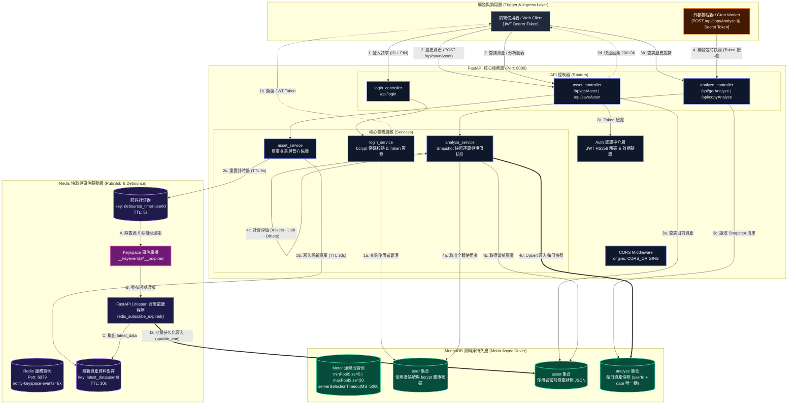

# Asset Management Backend (資產管理系統後端服務)

基於 **FastAPI**、**Redis (Keyspace Events)** 與 **MongoDB (Motor)** 建構的高效能非同步資產管理與趨勢分析後端。系統針對使用者高頻編輯場景，獨創「**Redis 防抖延遲回寫機制 (Write-Behind Cache Debounce)**」，大幅削峰並保護資料庫 I/O；同時具備定時資產快照與淨值彙整運算功能。

---

## 系統架構



---

## 專案結構

```
Asset_Management_backend/
├── api/                             # API 控制層 (路由定義、驗證中介注入與請求轉發)
│   ├── analyze_controller.py        # 資產分析端點：歷史趨勢查詢、手動快照與金鑰保護的批次排程歸檔
│   ├── asset_controller.py          # 個人資產端點：使用者資產讀取 (getAsset) 與防抖暫存 (saveAsset)
│   └── login_controller.py          # 認證端點：驗證使用者 PIN 碼並簽發短期 JWT Access Token
├── cache/                           # 快取與事件工作處理層 (Redis)
│   ├── redis_client.py              # 同步/非同步 Redis 連線客戶端封裝
│   ├── redis_repository.py          # 暫存邏輯：維護 latest_data (30s) 與 debounce_timer (5s)
│   └── redis_worker.py              # 系統生命週期 (Lifespan) 管理、冷啟動未落盤掃描與過期事件回寫監聽
├── db/                              # 資料庫連線與資料存取層 (MongoDB / Motor)
│   ├── __init__.py                  # 套件模組初始化標記
│   ├── mongo_client.py              # Motor 非同步連線池初始化 (配置 minPoolSize=5, maxPoolSize=20)
│   └── mongo_repository.py          # 資料庫 CRUD 封裝 (含連線預熱、資產儲存、分析快照 upsert)
├── dto/                             # 資料傳輸物件層 (Data Transfer Objects)
│   ├── __init__.py                  # 套件模組初始化標記
│   ├── asset_dto.py                 # 資產更新請求 Payload 驗證模型 (AssetRequest)
│   └── login_dto.py                 # 登入請求與回應資料模型 (LoginRequest, LoginResponse)
├── model/                           # 領域模型與資料結構定義 (Pydantic Models)
│   ├── __init__.py                  # 套件模組初始化標記
│   ├── asset_data.py                # 階層化資產結構：Category -> SubCategory -> Card (含金額自動標準化驗證)
│   ├── copy_token.py                # 批次抄寫分析端點授權 Token 驗證模型 (CopyRequest)
│   ├── snapshot.py                  # 資產快照模型 (Snapshot, SnapshotCategory, Totals, SnapshotDTO)
│   └── user_info.py                 # JWT Payload 所載入的使用者基礎識別資訊 (UserInfo)
├── service/                         # 核心業務邏輯層 (Business Logic Layer)
│   ├── __init__.py                  # 套件模組初始化標記
│   ├── analyze_service.py           # 資產轉快照運算邏輯 (彙總項目金額、計算淨值) 與全使用者批次抄寫
│   ├── asset_service.py             # 個人資產查詢與暫存寫入排程協調
│   ├── auth.py                      # FastAPI OAuth2 Bearer Token 依賴注入與 JWT 效期核身
│   └── login_service.py             # 登入 PIN 碼比對 (passlib bcrypt) 與 JWT Token 產生
├── app.py                           # 應用程式入口點 (FastAPI 實例化、CORS 註冊、Lifespan 掛載、路由加載)
├── requirements.txt                 # Python 依賴套件定義檔 (FastAPI, Motor, Redis, Pydantic, Passlib 等)
├── .gitignore                       # Git 忽略配置清單
└── README.md                        # 系統核心架構與開發維運技術文件
```

---

## 核心機制解析

### 1. Redis Keyspace 防抖延遲回寫 (Write-Behind Cache Debounce)
- **問題背景**：前端在拖曳、微調資產數字或頻繁編輯多個項目時，若每次 HTTP 請求皆直接寫入 MongoDB，將造成大量 I/O 爭搶與資料庫寫入放大。
- **解法設計**：
  1. 前端送出 `POST /api/saveAsset` 時，後端將資料寫入 Redis `latest_data:{userId}` (TTL 30s)，並建立/刷新 `debounce_timer:{userId}` (TTL 5s)。
  2. 使用者在 5 秒內的後續編輯會持續刷新 `debounce_timer`，後端即刻回應成功。
  3. 使用者靜置滿 5 秒後，Redis 自動觸發過期事件 `__keyevent@*__:expired`。
  4. 背景程序 `redis_subscribe_expired` 捕捉事件，取出 `latest_data:{userId}` 並非同步持久化至 MongoDB `asset` 集合。
  5. **冷啟動補償機制**：服務在重新啟動時（FastAPI lifespan），會自動執行 `scan_iter("latest_data:*")` 掃描所有因重開機可能遺留的暫存資料，立即補償存入 MongoDB，保證資料不流失。

### 2. 資產結構轉換與歷史快照 (Asset Snapshot & Net Worth Calculation)
- **階層模型**：資產資料以 `Category` (資產、負債、其他) 包含多個 `SubCategory` (如現金、股票、房貸)，各子類別下掛多個 `Card` 項目。
- **快照演算法**：
  $$\text{NetWorth (淨資產)} = \text{Total Assets} - \text{Total Liabilities} - \text{Total Others}$$
- **定時/批次抄寫**：透過 `POST /api/copyAnalyze`（需帶 Secret Key 授權），系統可每日自動將全站使用者的資產狀態轉換為規格化快照 (`Snapshot`)，Upsert 存入 `analyze` 集合，供前端繪製資產隨時間變化的折線與圓餅分析圖。

---

## 環境變數設定

請在專案根目錄建立 `.env` 檔案，填入以下參數：

| 變數名稱 | 必填 | 說明 | 範例值 |
| :--- | :---: | :--- | :--- |
| `CORS_ORIGINS` | 是 | 允許跨域請求的來源 (逗號分隔) | `http://localhost:3000,http://localhost:5173` |
| `REDIS_URL` | 是 | Redis 連線字串 | `redis://localhost:6379/0` |
| `MONGO_URL` | 是 | MongoDB 連線字串 | `mongodb://localhost:27017` |
| `ASSET_DB` | 是 | 系統使用的 MongoDB 資料庫名稱 | `asset_management` |
| `SECRET_KEY` | 是 | JWT 簽發與解碼用密鑰 | `your-secure-jwt-secret` |
| `ALGORITHM` | 是 | JWT 簽署演算法 | `HS256` |
| `EXPIRE_MINUTES`| 是 | JWT Token 有效期限 (分鐘) | `60` |
| `COPY_SECRET_KEY`| 是 | 批次抄寫快照端點的授權 Token | `your-cron-batch-token` |

---

## 本機啟動與開發

### 1. 建立並啟用虛擬環境
```bash
python3 -m venv venv
source venv/bin/activate  # macOS / Linux
# 或 .\venv\Scripts\activate  # Windows
```

### 2. 安裝依賴套件
```bash
pip install -r requirements.txt
```

### 3. 啟動本機開發伺服器
```bash
uvicorn app:app --reload --host 0.0.0.0 --port 8000
```
- API 文件 (Swagger UI)：`http://localhost:8000/docs`
- 替代文件 (ReDoc)：`http://localhost:8000/redoc`

---

## API 規格摘要

所有受保護 API 皆須在 HTTP Header 中帶上 `Authorization: Bearer <access_token>`。

| 方法 | 路徑 | 授權 | 說明 |
| :--- | :--- | :---: | :--- |
| `POST` | `/api/login` | 否 | 使用者登入驗證（傳入 `ID` 與 `pin`），取得 JWT Token |
| `GET` | `/api/getAsset?userId={id}` | 是 | 取得指定使用者的當前資產清單 |
| `POST` | `/api/saveAsset` | 是 | 暫存使用者資產，觸發 5 秒防抖延遲持久化 |
| `GET` | `/api/getAnalyze?userId={id}` | 是 | 取得指定使用者的歷史資產快照與淨值數據 |
| `GET` | `/api/manualcopyAnalyze?userId={id}` | 否 | 手動為指定使用者產生一筆當日的資產快照 |
| `POST` | `/api/copyAnalyze` | 否* | 批次執行全使用者快照產出（*須在 Body 傳入合法的 `token`） |
